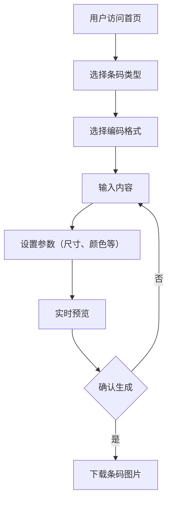
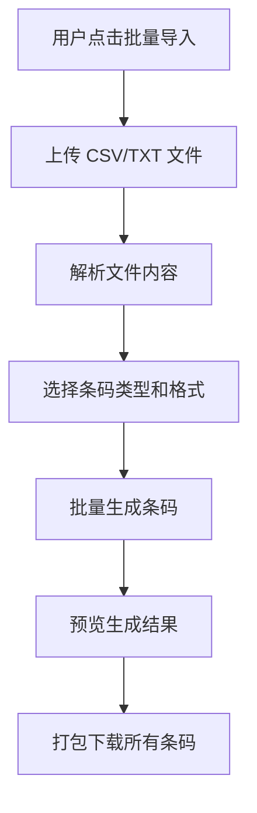
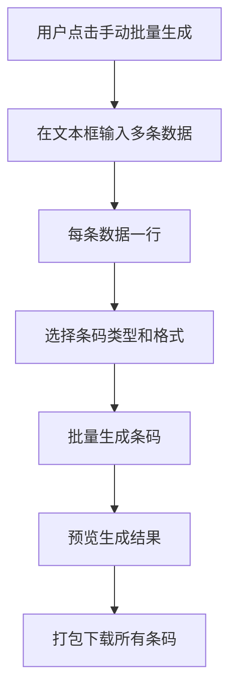

## 1. 产品概述

一个专业的二维码和条形码生成网站，支持多种编码格式，提供批量导入和手动批量生成功能，可部署在 Cloudflare Workers 和 Pages 平台上。

- **核心目的**: 为用户提供便捷、高效的二维码/条形码生成服务，支持多种编码标准和批量操作
- **目标用户**: 开发者、企业用户、电商从业者、物流行业人员等需要批量生成条码的人群
- **市场价值**: 解决传统条码生成工具功能单一、不支持批量操作的痛点，提供一站式条码生成解决方案

## 2. 核心功能

### 2.1 功能模块

1. **二维码生成**: 支持多种二维码编码格式（QR Code、Data Matrix、Aztec、PDF417等）
2. **条形码生成**: 支持多种条形码编码格式（Code 128、Code 39、UPC-A、UPC-E、EAN-13、EAN-8、ITF-14等）
3. **批量导入**: 支持从文件（CSV/TXT）批量导入数据并生成条码
4. **手动批量生成**: 支持在页面上批量输入多条数据并生成条码
5. **导出功能**: 支持导出为 PNG、SVG、PDF 格式，支持批量打包下载

### 2.2 页面详情

| 页面名称 | 模块名称 | 功能描述 |
|-----------|-------------|---------------------|
| 首页 | 二维码生成 | 输入内容，选择编码格式，实时预览并下载二维码 |
| 首页 | 条形码生成 | 输入内容，选择编码格式，实时预览并下载条形码 |
| 首页 | 批量导入 | 上传 CSV/TXT 文件，批量生成条码并打包下载 |
| 首页 | 手动批量生成 | 在文本框中输入多条数据，批量生成条码 |
| 首页 | 导出设置 | 选择导出格式（PNG/SVG/PDF），设置尺寸、边距等参数 |

## 3. 核心流程

### 3.1 单个条码生成流程

### 3.2 批量导入流程

### 3.3 手动批量生成流程

## 4. 用户界面设计

### 4.1 设计风格

- **主色调**: 科技感深蓝色 (#0f172a) 搭配明亮的青色 (#06b6d4) 作为强调色
- **按钮风格**: 圆角矩形，渐变背景，悬停时缩放动画
- **字体**: 现代无衬线字体，使用 Inter 作为主字体
- **布局**: 卡片式布局，左右分栏设计，左侧为输入区域，右侧为预览区域
- **图标**: 使用 Lucide Icons，简洁现代的风格

### 4.2 页面设计概述

| 页面名称 | 模块名称 | UI 元素 |
|-----------|-------------|-------------|
| 首页 | 顶部导航 | Logo、导航菜单、主题切换按钮 |
| 首页 | 条码类型选择 | 标签切换（二维码/条形码） |
| 首页 | 编码格式选择 | 下拉选择框，列出所有支持的格式 |
| 首页 | 内容输入 | 文本输入框，支持多行输入 |
| 首页 | 参数设置 | 尺寸滑块、颜色选择器、边距设置 |
| 首页 | 预览区域 | 实时预览生成的条码图像 |
| 首页 | 操作按钮 | 生成按钮、下载按钮、复制按钮 |
| 首页 | 批量导入 | 文件上传区域、解析结果展示 |
| 首页 | 手动批量生成 | 大文本输入框、批量生成按钮 |

### 4.3 响应式设计

- **桌面端**: 左右分栏布局，左侧输入右侧预览
- **平板端**: 上半部分输入，下半部分预览
- **移动端**: 单栏滚动布局，各模块垂直排列

### 4.4 交互设计

- **实时预览**: 输入内容变化时自动更新预览
- **动画效果**: 生成成功时显示庆祝动画，按钮悬停有缩放效果
- **加载状态**: 批量生成时显示进度条
- **错误提示**: 输入无效内容时显示友好的错误提示

## 5. 支持的编码格式

### 5.1 二维码格式
- QR Code
- Data Matrix
- Aztec
- PDF417
- MaxiCode

### 5.2 条形码格式
- Code 128 (A/B/C)
- Code 39
- UPC-A
- UPC-E
- EAN-13
- EAN-8
- ITF-14
- Codabar
- Interleaved 2 of 5
- Standard 2 of 5
- MSI Plessey