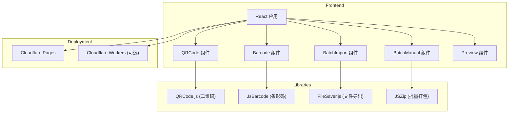

## 1. 架构设计



## 2. 技术描述

- **前端框架**: React@18 + TypeScript
- **构建工具**: Vite@6
- **样式**: TailwindCSS@3
- **二维码库**: qrcode.react (React 组件) + qrcode (Canvas/SVG 生成)
- **条形码库**: jsbarcode (支持多种条形码格式)
- **文件导出**: file-saver + jszip (批量打包下载)
- **图标**: lucide-react
- **部署**: Cloudflare Pages (静态站点) + Cloudflare Workers (可选 API)

## 3. 项目结构

```
barcode-generator/
├── src/
│   ├── components/
│   │   ├── QRCodeGenerator.tsx    # 二维码生成组件
│   │   ├── BarcodeGenerator.tsx   # 条形码生成组件
│   │   ├── BatchImport.tsx        # 批量导入组件
│   │   ├── BatchManual.tsx        # 手动批量生成组件
│   │   ├── PreviewPanel.tsx       # 预览面板组件
│   │   ├── SettingsPanel.tsx      # 参数设置组件
│   │   └── Header.tsx             # 顶部导航组件
│   ├── hooks/
│   │   ├── useQRCode.ts           # 二维码生成 Hook
│   │   └── useBarcode.ts          # 条形码生成 Hook
│   ├── utils/
│   │   ├── barcodeFormats.ts      # 条形码格式定义
│   │   ├── qrCodeFormats.ts       # 二维码格式定义
│   │   ├── fileParser.ts          # 文件解析工具
│   │   └── exportUtils.ts         # 导出工具
│   ├── types/
│   │   └── index.ts               # TypeScript 类型定义
│   ├── App.tsx                    # 主应用组件
│   ├── main.tsx                   # 入口文件
│   └── index.css                  # 全局样式
├── public/
│   └── index.html                 # HTML 模板
├── package.json
├── tsconfig.json
├── vite.config.ts
├── tailwind.config.js
└── wrangler.toml                  # Cloudflare Workers 配置 (可选)
```

## 4. 路由定义

| 路由 | 用途 |
|-------|---------|
| / | 首页 - 包含所有生成功能 |
| /qrcode | 二维码生成页 |
| /barcode | 条形码生成页 |
| /batch | 批量生成页 |

## 5. API 定义 (Cloudflare Workers)

### 5.1 生成二维码 API

**POST** `/api/qrcode`

请求体:
```json
{
  "content": "string",
  "format": "qrcode|datamatrix|aztec|pdf417",
  "size": 256,
  "color": "#000000",
  "bgColor": "#ffffff",
  "output": "png|svg"
}
```

响应体:
```json
{
  "success": true,
  "data": "base64_image_string",
  "format": "png"
}
```

### 5.2 生成条形码 API

**POST** `/api/barcode`

请求体:
```json
{
  "content": "string",
  "format": "code128|code39|ean13|ean8|upca|upce|itf14",
  "width": 2,
  "height": 100,
  "color": "#000000",
  "bgColor": "#ffffff",
  "output": "png|svg"
}
```

响应体:
```json
{
  "success": true,
  "data": "base64_image_string",
  "format": "png"
}
```

### 5.3 批量生成 API

**POST** `/api/batch`

请求体:
```json
{
  "items": ["string1", "string2", "string3"],
  "type": "qrcode|barcode",
  "format": "code128",
  "size": 256,
  "output": "png"
}
```

响应体:
```json
{
  "success": true,
  "count": 3,
  "files": [
    { "name": "item-1.png", "data": "base64..." },
    { "name": "item-2.png", "data": "base64..." },
    { "name": "item-3.png", "data": "base64..." }
  ]
}
```

## 6. 数据模型

### 6.1 条码参数类型

```typescript
interface BarcodeParams {
  content: string;
  format: string;
  width?: number;
  height?: number;
  size?: number;
  color?: string;
  bgColor?: string;
  margin?: number;
  output?: 'png' | 'svg' | 'pdf';
}

interface BatchItem {
  id: string;
  content: string;
  status: 'pending' | 'generated' | 'error';
  data?: string;
  error?: string;
}
```

## 7. 部署配置

### 7.1 Cloudflare Pages 部署

- **构建命令**: `npm run build`
- **输出目录**: `dist`
- **环境变量**: 无需环境变量（纯前端应用）

### 7.2 Cloudflare Workers 部署 (可选)

使用 `wrangler.toml` 配置:

```toml
name = "barcode-api"
type = "javascript"
compatibility_date = "2024-01-01"
```

Worker 入口文件 `src/index.ts`:
- 接收 HTTP 请求
- 调用条码生成库
- 返回 Base64 编码的图像数据

## 8. 第三方库说明

| 库名称 | 版本 | 用途 |
|--------|------|------|
| qrcode | ^1.5.3 | 二维码生成核心库 |
| jsbarcode | ^3.11.5 | 条形码生成核心库 |
| file-saver | ^2.0.5 | 文件下载工具 |
| jszip | ^3.10.1 | ZIP 打包工具 |
| lucide-react | ^0.294.0 | 图标库 |
| @types/node | ^20.0.0 | TypeScript 类型定义 |